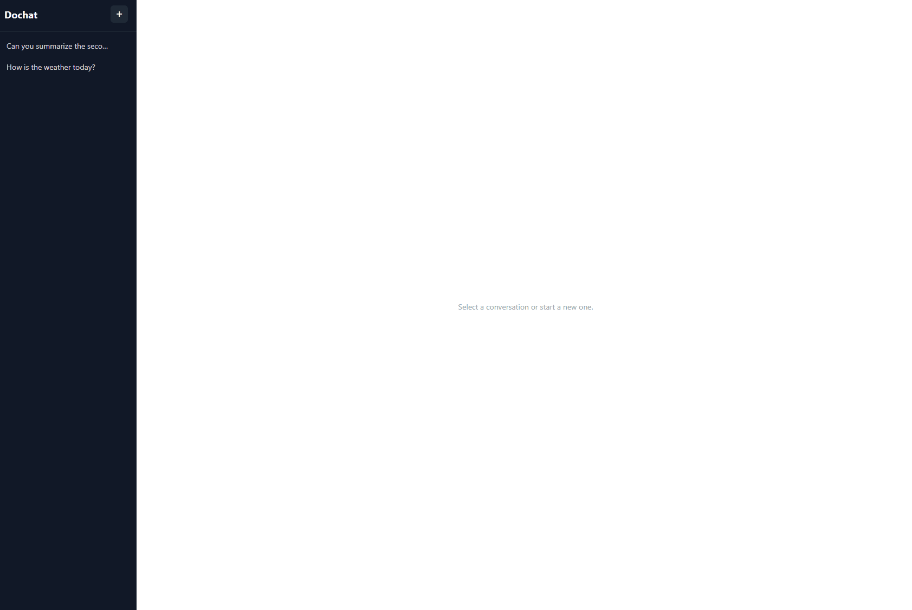

# Dochat

A full-stack AI chat app that lets you upload a PDF and have a conversation with it. Built as a self-studied project about streaming responses (SSE), retrieval-augmented generation.



## What it does

- **Streaming chat**: responses come back token-by-token over Server-Sent Events, not as one blocking request.
- **PDF upload + RAG**: upload a PDF and it's extracted, chunked, embedded, and stored in a local vector database. Every question you ask retrieves the most relevant chunks and feeds them to the model as context, so answers are grounded in the document instead of the model just guessing.

## Tech stack

|              |                                                            |
| ------------ | ---------------------------------------------------------- |
| Frontend     | React + TypeScript, SCSS Modules, Vite                     |
| Backend      | Python, Flask                                              |
| AI           | OpenAI GPT-4o (chat) + text-embedding-3-small (embeddings) |
| Vector store | ChromaDB (local, persisted to disk)                        |

## How it works

**Upload:** PDF => extract text (`pypdf`) => split into overlapping chunks => embed each chunk => store in ChromaDB.

**Chat:** user message => embed it => query ChromaDB for the closest chunks => inject them into the system prompt => stream the model's response back over SSE => frontend appends each token to the last message as it arrives.

```
frontend/src/
  api/chat.ts          fetch + SSE stream parsing
  hooks/useChat.ts      message state, sending, streaming
  hooks/useUpload.ts    file upload state
  components/Chat/      UI

backend/app/
  api/chat.py            POST /api/chat: retrieves context, streams the response
  api/upload.py          POST /api/upload: extracts, chunks, embeds, indexes
  services/rag.py        embedding + retrieval + prompt building
  clients/               OpenAI and ChromaDB client setup
  utils/helpers.py       PDF text extraction, chunking
```

## Getting started

### Backend

```bash
cd backend
python -m venv .venv
.venv\Scripts\activate      # Windows
source .venv/bin/activate   # macOS/Linux

pip install -r requirements.txt
cp .env.example .env        # then add your own OPENAI_API_KEY
python run.py
```

Backend runs on `http://localhost:5000`.

### Frontend

```bash
cd frontend
npm install
npm run dev
```

Frontend runs on `http://localhost:3000` and proxies `/api/*` requests to the backend (see `vite.config.ts`).

## Current limitations

This is a learning project, not a production app so some corners are deliberately cut for now:

- One global document collection: uploading a new PDF replaces the previous one, there's no per-user or per-conversation isolation.
- No auth, no persisted chat history: refreshing the page loses the conversation.
- Chunking is character-based (fixed size + overlap), not token- or sentence-aware.

## Roadmap

- [ ] Persist conversation history properly
- [ ] Tool calling (e.g. web search, get current date)
- [ ] Stop button to cancel mid-stream
- [ ] Multi-document support
- [ ] Chat history sidebar (multiple conversations)
- [ ] Deploy backend (Railway/Render) + frontend (Vercel)
